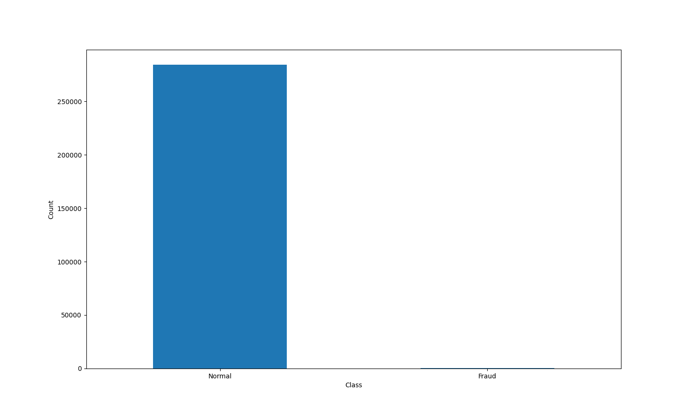
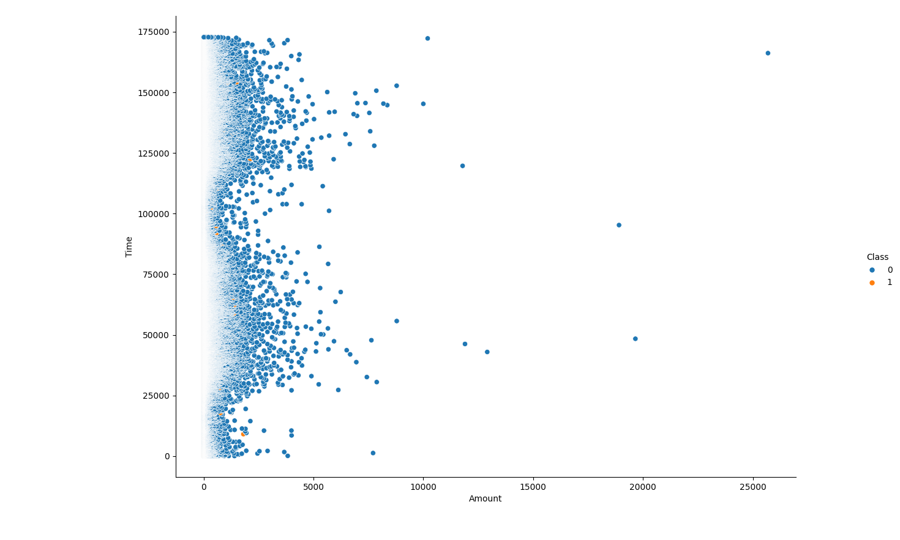

# 🛡️ EdgeRisk Analyzer – Real-Time Credit Card Fraud Detection on ESP32

## 🎥 Demo Video  
  
> 🔗 *Click above to watch a live demo of EdgeRisk Analyzer in action!*

---

## 🚀 Project Overview  
**EdgeRisk Analyzer** is a real-time, edge-deployed fraud detection system powered by a quantized deep neural network. Built for ultra-low-power environments, the system runs entirely on an **ESP32 microcontroller (240MHz, 128KB RAM)** using **TensorFlow Lite for Microcontrollers**, without any cloud dependence.

This project highlights my ability to **optimize machine learning models for embedded hardware** and deploy intelligent systems in constrained environments.

---

## 🔍 Key Metrics & Highlights

| Feature              | Value                           |
|----------------------|---------------------------------|
| **Dataset**          | 284,807 real-world transactions |
| **Features Used**    | 30+ engineered input variables  |
| **Model Accuracy**   | 94% (training)                  |
| **Quantization**     | int8 via TFLite Micro           |
| **Inference Time**   | ⚡ 0.06 ms per transaction       |
| **MCU Used**         | ESP32 Dev Module @ 240MHz (128KB RAM) |

### 📟 OLED Display Shows:
- 💵 **Transaction Amount**  
- 🔁 **Transaction ID**  
- ✅❌ **Transaction Status** (Safe / Fraudulent)  
- ⏱️ **Inference Time (ms)**  

### 🔴🟢 LED Indicators:
- **Red LED** → Fraudulent Transaction (Blocked)  
- **Green LED** → Safe Transaction (Approved)

### 📡 Future-Ready:
- Built-in **WiFi & Bluetooth** for AWS/mobile alert integration

---

## 📊 Visual Insights

### ⚖️ Class Distribution – Normal vs Fraudulent

> Note: This shows the extreme class imbalance in the dataset — a real-world challenge that makes fraud detection harder and more meaningful.

### 🕵️ Transaction Scatter by Time & Amount

---

## 📸 Project Snapshots

### 🖥️ OLED Output  
 

### 🔌 Full Hardware Setup  
 

---

## ⚙️ Tech Stack

- **Languages:** Python, C++  
- **Frameworks:** TensorFlow, TensorFlow Lite Micro  
- **Hardware:** ESP32 Dev Module, SSD1306 OLED Display  

---

## 🧠 System Architecture

1. **Data Pipeline:** Preprocessed 284,807 credit card transactions with 30+ features.
2. **Model Training:** Trained a dense neural network using TensorFlow; quantized to int8.
3. **Model Deployment:** Deployed using TensorFlow Lite Micro on ESP32 (128KB RAM).
4. **On-Device Execution:** Real-time inference + OLED visualization + LED alerts.
5. **Hardware I/O:** Inputs simulated via serial; output shown via OLED & LEDs.
6. **Connectivity Layer:** WiFi/Bluetooth stack initialized for future cloud/phone alerts.

---

## 🛠️ Build & Deployment Pipeline

1. Train fraud detection model in Python with TensorFlow  
2. Quantize model using post-training int8 quantization  
3. Convert `.h` model file using `xxd` for microcontroller use  
4. Integrate model into Arduino IDE via `TensorFlowLite.h` and `fraud_model.h`  
5. Program OLED and GPIO feedback via C++  
6. Upload firmware to ESP32 and test real-time predictions  

---

## 📦 Real-World Applications

- Offline credit card scanners for remote/rural ATMs  
- Smart POS terminals with built-in fraud filtering  
- Embedded risk engines for edge IoT finance devices  
- Educational demo for ML + Embedded Systems + Security  

---

## 📬 Contact & Collaboration

Open to feedback, collaboration, or integration ideas!  
Feel free to connect on [LinkedIn](https://www.linkedin.com/in/YOUR-LINKEDIN-HERE) or raise a GitHub issue!

